# Configuración de AWS KMS e IAM para SOPS 

Esta es una guía para configurar AWS KMS y un rol IAM que permita el uso de SOPS con Terraform. Es
importante asegurarse que su cuenta de AWS tenga permisos necesarios para
creación y administración de claves KMS, roles IAM y políticas de permisos.

- [Consola AWS](#desde-la-consola-aws)
- [Terraform](#con-terraform)

**Nota:** El uso de AWS KMS tiene costos asociados. No se olvide de consultar [la página de costos](https://calculator.aws) de AWS para obtener la información más actualizada.

## Desde la consola AWS

Instrucciones paso a paso para configurar AWS KMS e IAM directamente desde la consola de AWS.

### Configuración de AWS KMS

#### Crear clave KMS
En la barra de búsqueda de servicios de AWS, escriba "KMS" y seleccione "Key Management Service".
Haga clic en "Crear clave".
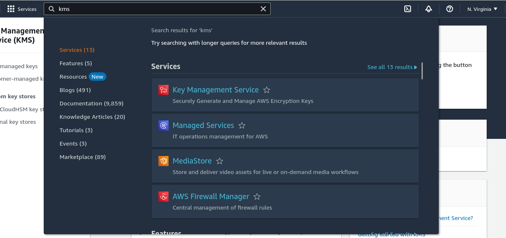
Elija "Simétrica", "Cifrar y decifrar" y haga clic en "Siguiente".
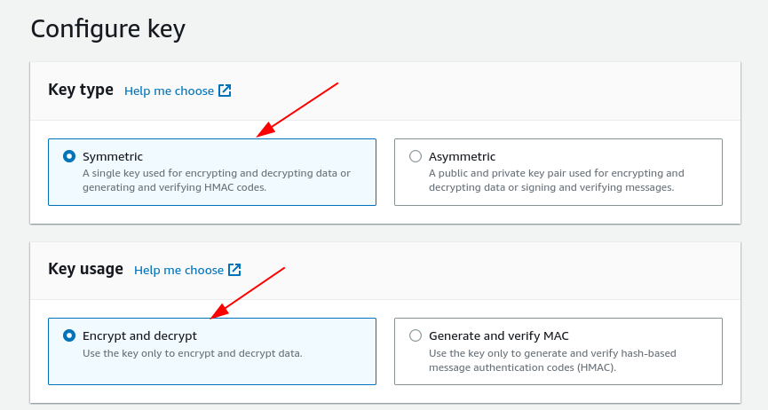
Proporcione un alias y una descripción para la clave. Cree la clave.
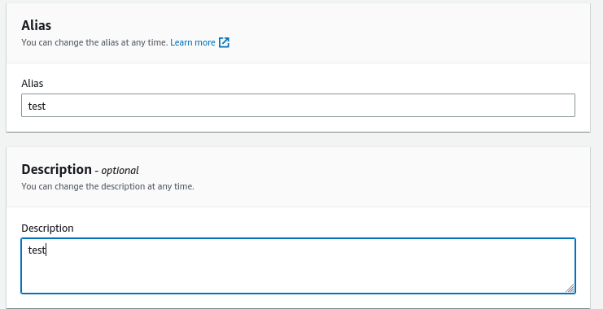


### Configuración del Rol IAM para SOPS

#### Crear un nuevo rol
Navegar al panel de IAM en la Consola de AWS.
Hacer clic en "Roles" en la barra lateral izquierda, luego "Crear rol".
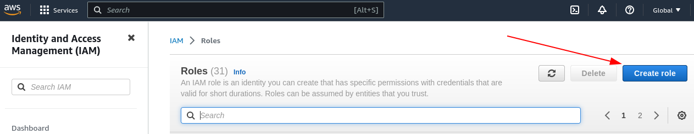

Elegir "Cuenta AWS" como el tipo de entidad de confianza. Seleccionar la cuenta que tendrá permisos para usar el rol.

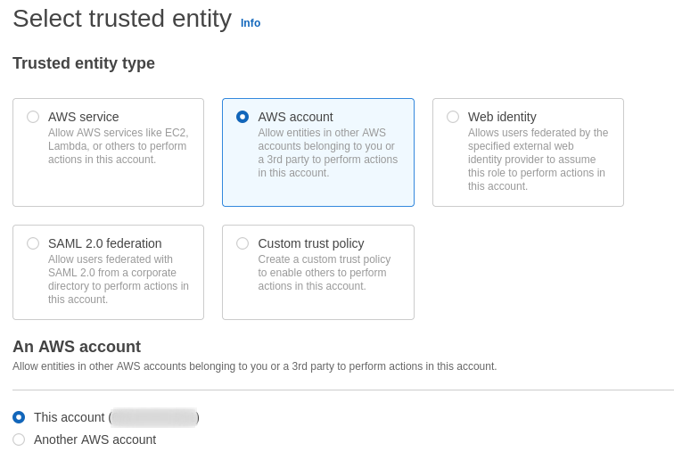

Adjuntar políticas de permisos. 
En este paso se puede crear una nueva politica de permisos. Para hacer esto,
buscar 'kms' en la barra de busqueda, y seleccionar los permisos necesarios. Para una guía de cuales permisos son necesarios, se puede ver el archivo main.tf y las políticas definidas en el recurso "aws_iam_role_policy". Siempre es ideal otorgar los mínimos permisos necesarios. En este caso al menos necesitaremos permisos para cifrar y decifrar con la clave.
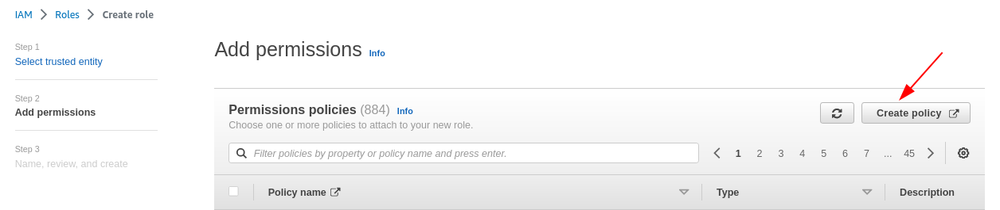
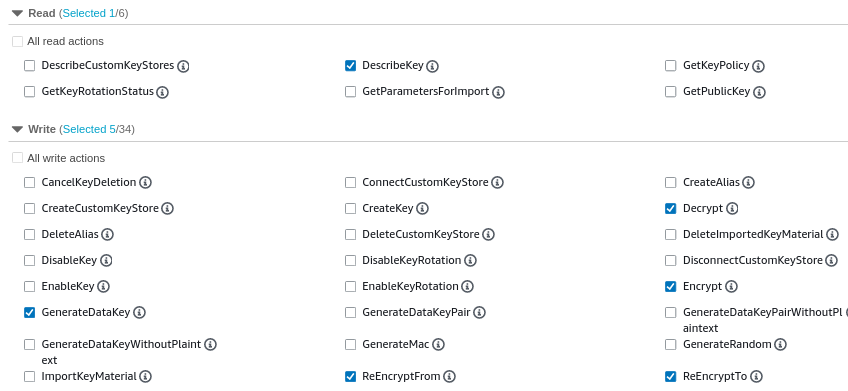

Agregar un nombre y descripción para la nueva politica, y crearla.
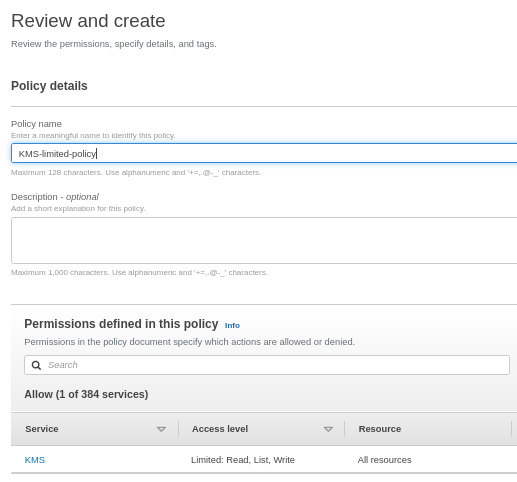

Luego de crear la politica, revise que este todo bien y cree el rol.
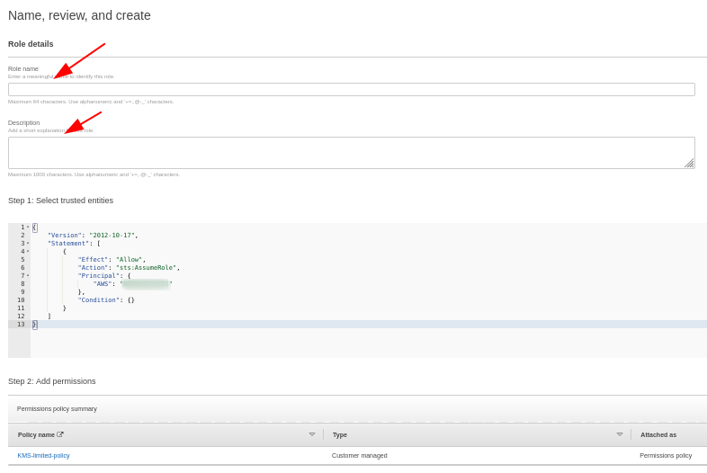

#### Modifique las relaciones de confianza (si es necesario)
Si necesita modificar la relación de confianza (por ejemplo, para permitir que otra cuenta de usuario de AWS asuma el rol), haga clic en el rol, navegue a la pestaña "Relaciones de confianza" y edite la política.

#### Asegurese que su usuario IAM tiene permisos para asumir el rol

Recuerde que el la relación de confianza del rol debería permitir que la cuenta
asuma el rol (esto debería estar seteado por defecto, pero puede agregrar otra
cuenta u otro usuario en este paso). El usuario IAM debería tener permisos para asumir el rol, y el rol debe tener la politica de permsos para
usar la clave KMS. 

### Limpieza 

Es crucial realizar la limpieza después de terminar para evitar costos innecesarios.

#### Elimine la clave KMS 
Para elimiar la clave, vaya al panel de KMS y seleccione programar la eliminación de la clave KMS. Tenga en cuenta que AWS conserva la clave durante un período predeterminado (generalmente 7-30 días) antes de su eliminación real.

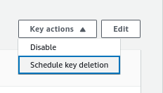
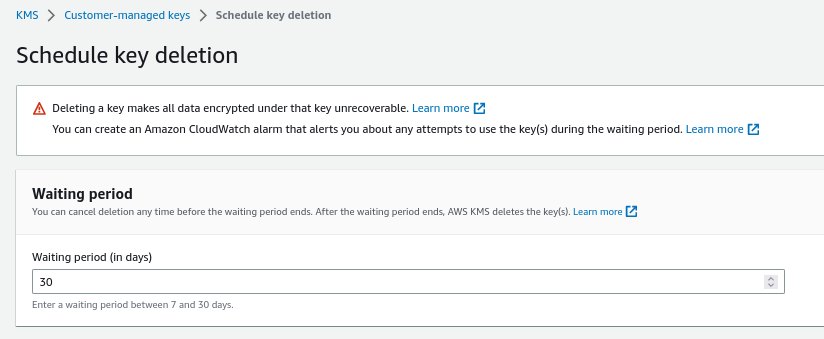

#### Elimine el rol IAM
Aunque estos recursos no tienen costos asociados (los costos se asocian mayormente a las claves KMS), capaz prefiera eliminarlos. Vaya al panel de IAM, haga clic en "Roles", seleccione el rol que creó y elimínelo. Si desea, también puede eliminar las políticas creadas. 

## Con Terraform

Instrucciones para configurar AWS KMS e IAM utilizando archivos de Terraform incluidos en este repositorio.

Este repositorio contiene archivos de Terraform para configurar una clave KMS en AWS y un rol IAM con permisos para usar esa clave con SOPS.

### Requisitos previos

 - [Terraform
   instalado](https://developer.hashicorp.com/terraform/tutorials/aws-get-started/install-cli)
 - [AWS CLI](https://docs.aws.amazon.com/cli/latest/userguide/getting-started-install.html) configurado con las credenciales adecuadas

### Instrucciones

Se debe copiar el .envrc.local-sample al .envrc.local
```
cp .envrc.local-sample .envrc.local 
```
Se debe editar con los valores necesarios, notablemente el AWS_PROFILE y
AWS_REGION, estos son el ARN del usuario AWS con permisos para crear los recursos, y la región donde serán creados. Acordate que no se debe versionar este archivo. Por esto es
que esta agregado al archivo .gitignore para este subdirectorio.

Inicialización de Terraform:

```
terraform init
```
Revise los cambios propuestos:

```
terraform plan
```

Aplicar la configuración:

```
terraform apply
```
Destruir los recursos (para evitar costos innecesarios):
```
terraform destroy
```

